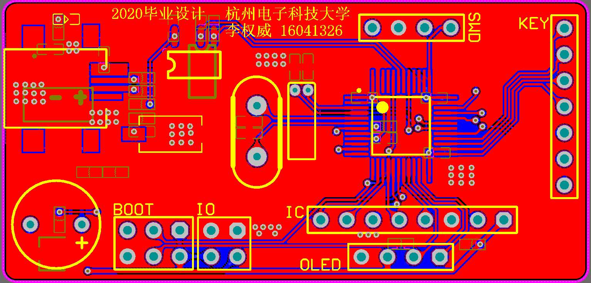
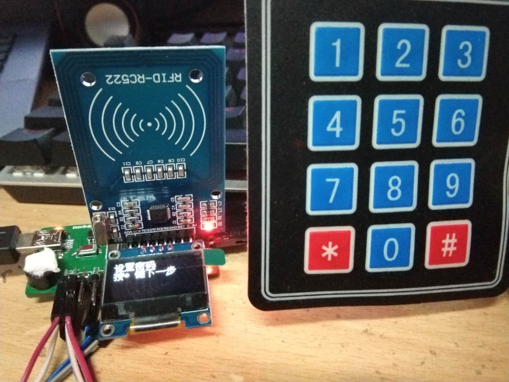
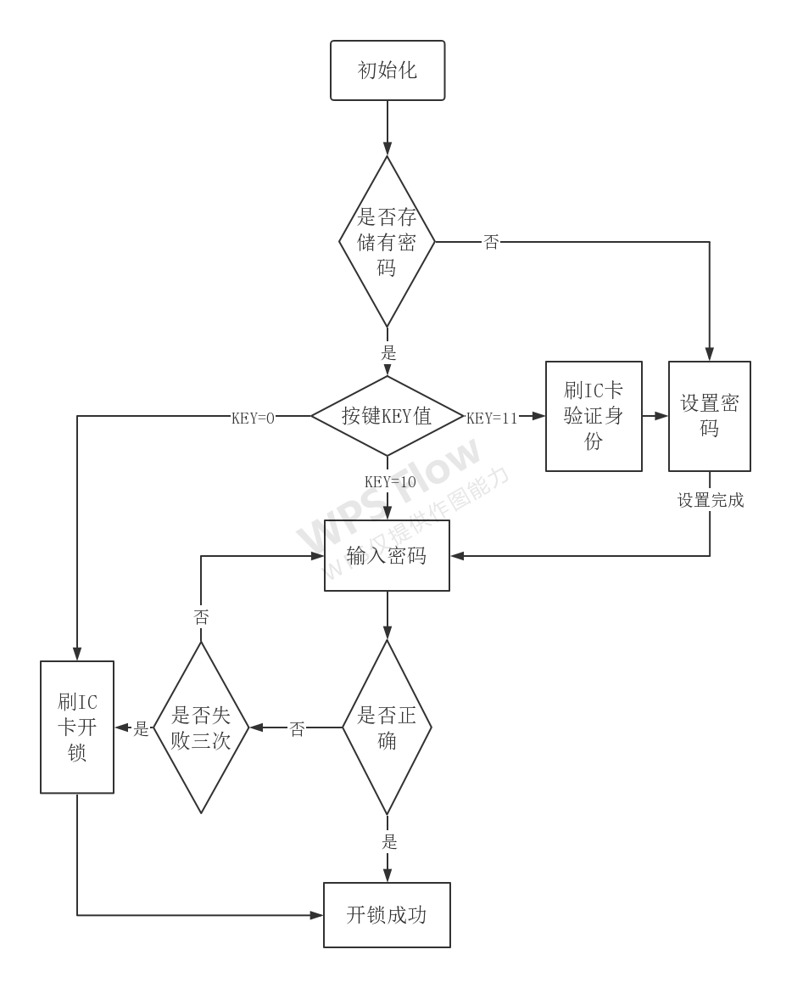

# electronic_code_lock
基于STM32F103C8T6、AT24C02存储芯片、RC522射频模块、OLED、矩阵键盘的多功能电子密码锁

---

### 目录解说：
```
ending_code 是32单片机的工程。
hard_ware 是系统硬件设计工程，包括原理图、PCB，最终进行投板做成实物。
```
### 硬件设备
1、PCB设计图


2、串口调试设备


3、软件设计流程图


---

## 项目总结
系统目前实现功能：
```
（1）支持6位数字密码的创建和IC身份卡信息的录入。
（2）新建数字密码时，支持再次确认新密码。
（3）支持输入数字密码开锁和IC身份验证开锁两种方式。
（4）IC卡身份验证后，可以修改数字密码。
（5）在输入错误数字密码超过3次后，仅支持IC卡身份开锁。
```

不足与改进：
```
（1）硬件布局的缺陷，没有充分考虑人性化，没有考虑更多的拓展功能。
（2）没有加入开锁驱动电路，只是通过蜂鸣器和OLED展示是否开锁成功。
（3）希望通过WIFI与云平台、APP相结合，实现APP控制开锁并将开锁频率相关数据存储云平台。
```